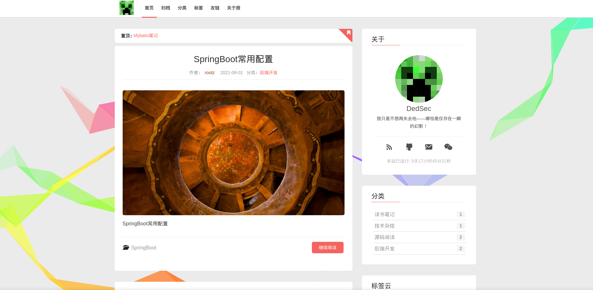
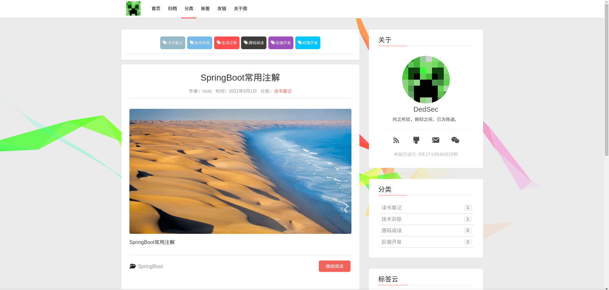
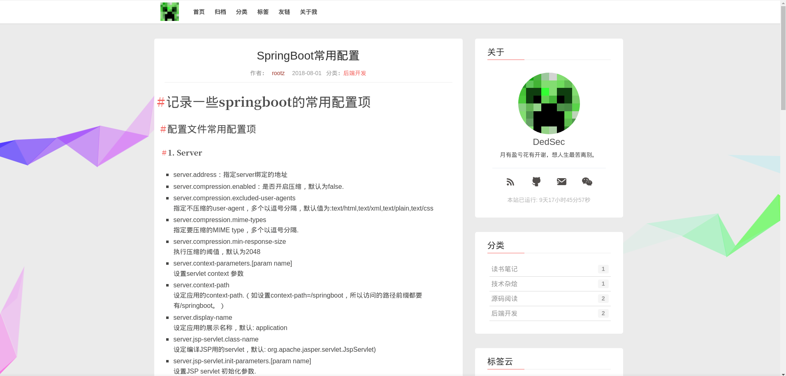
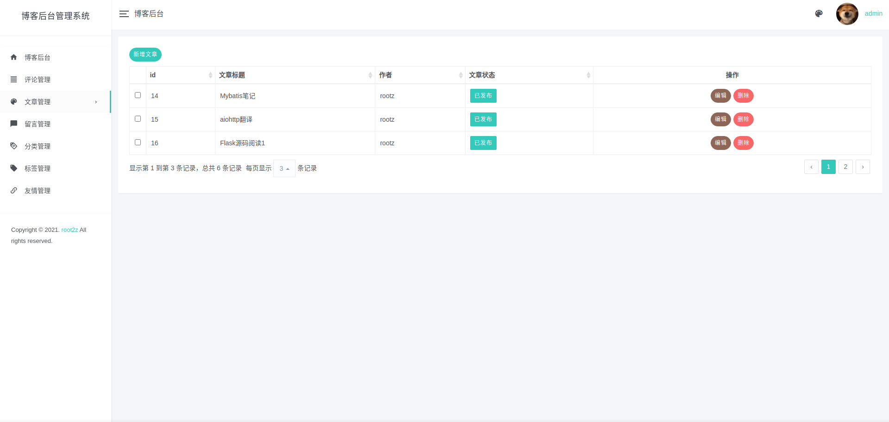

# 关于项目

该项目是基于 `SpringBoot` + `Mybatis` 实现的个人博客系统。

主要的使用的技术和软件如下：

* SpringBoot
* Mybatis
* Maven
* MySQL
* Idea

该项目的主要特性如下：

* 使用阿里云OSS管理静态资源
* 在编写文章时实现粘贴图片上传到阿里云OSS
* 后台管理提供多种样式选择
* ...

对于一个个人博客来说，这个博客系统还是有很多不完美的地方，只是达到了一个最基础最基础的博客系统该有的功能，在未来的话，我会持续为这个博客进行优化，争取做的更好。

## 效果预览

首页



分类页



文章详情页



后台登录页


文章管理页



## 如何运行

### 本地运行

请在 `application-prod.yml` 中完善数据库信息，并且设置 `application.yml` 中的 `active` 属性为 `prod`。数据库脚本和数据脚本已经导入 `docs`
文件夹，在本地的数据库中导入建表文件和数据之后，最后在 `application.yml`
中配置阿里云OSS配置属性，然后就可以运行了。

管理后台地址为：[http://localhost:8080/admin/login](http://localhost:8080/admin/login) 。 帐号：admin，密码：qwerty123_

### `docker` 中部署

首先执行当前目录下的 `install-mysql.sh`，有几个变量可以自定义，详细注释已经写在 `install-mysql.sh` 内，请自行查看。执行完 `install-mysql.sh` 脚本后，执行下面的命令，用于导入建表脚本和数据脚本到上面创建的容器。注意 `-i` 参数后面的名字是容器名字，要和你创建的容器名字相对应。

```shell
docker exec -i blog-mysql mysql -uroot -p123456 blog < ./docs/schema.sql
docker exec -i blog-mysql mysql -uroot -p123456 blog < ./docs/data.sql
```

修改 `resources/application-docker.yml` ，配置正确的数据库连接并且在 `application.yml` 中设置 `active` 属性为 `docker`，同时配置 `application.yml` 中的阿里云 OSS 属性，最后执行下面命令。

```shell
# 确保 target 文件夹被清空
mvn clean 

# 发布 jar 包
mvn package

# 构建镜像
docker build -t blog:v1 .
```

最终，执行 `docker run -p 9090:9090 --name blog --link blog-mysql:mysql5.6 -d blog:v1` 运行，打开浏览器输入 [http://127.0.0.1:9090](http://127.0.0.1:9090) 即可看到效果。